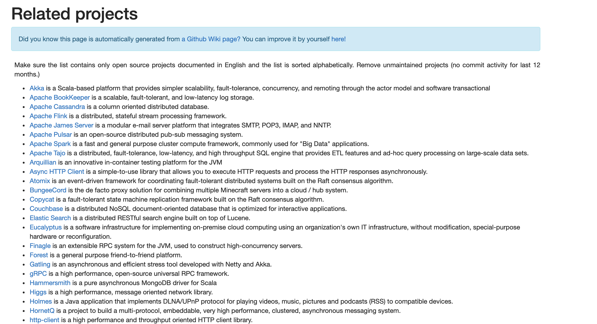

#BIO与NIO
在操作系统层面上，把网络IO分成了两类：


+ BIO：Blocking IO

    阻塞IO，阻塞的意思是：

+ NIO：No-blocking IO

    即非阻塞IO。在操作系统中又叫IO多路复用。它是由操作系统提供的系统调用，早期这个操作系统调用的名字是select，但是性能低下，
    后来渐渐演化成了Linux下的epoll和Mac里的kqueue。

IO和NIO的区别


### 例子：传统的HTTP服务器工作模式
1. 创建一个ServerSocket，监听并绑定一个端口
2. 一系列客户端来请求这个端口
3. 服务器使用Accept，获得一个来自客户端的Socket连接对象 
4. 服务端启动一个新线程处理连接     
    
    4.1 读Socket，得到字节流    
    
    4.2 解码协议，得到Http请求对象     
    
    4.3 处理Http请求，得到一个结果，封装成一个HttpResponse对象     
    
    4.4 编码协议，将结果序列化字节流
    
    4.5 写Socket，将字节流发给客户端 
    
5 继续循环 等待Accept
伪代码
```java 

        ServerSocket serverSocket;

        try {
            //建立服务器Socket,监听客户端请求
            serverSocket = new ServerSocket(port);
            System.out.println("Server is running on port:" + serverSocket.getLocalPort());
            //死循环不间断监听客户端请求
            while (true) {
                final Socket socket = serverSocket.accept();
                System.out.println("biuld a new tcp link with client,the cient address:" +
                        socket.getInetAddress() + ":" + socket.getPort());
                
                //新建线程并发处理HTTP客户端请求
                service(socket);
            }
        } catch (IOException e) {
            e.printStackTrace();
        }

```


## 传统BIO的瓶颈：

+ 服务端监听（Listen）时，3中的Accept是阻塞的，只有新连接来了，Accept才会返回，主线程才能继续

+ 读写socket时，Read是阻塞的，只有请求消息来了，Read才能返回，子线程才能继续处理
+ 读写socket时，Write是阻塞的，只有IO将数据发送出去之后，Write才能返回，子线程才能继续读取下一个请求（待考证）
以上这种socket的服务方式适用于HTTP服务器,每个http请求都是短期的,无状态的,
并且http后台的业务逻辑也一般比较复杂. 使用多线程和阻塞方式是合适的.


为什么要IO复用
传统两种阻塞式轮询的问题.都是一个线程监听端口的连接请求,然后产生一个线程去等待该连接的数据.
如果连接数很多的情况下. 会产生成百上万个线程. 
带来的问题.
1.线程唤醒睡醒需要cpu时间
2. 线程本身占用内存空间. java 0.5m大概.

那有什么办法能够解决这个问题呢. 这种轮询的模式改成推的模式. 更及时,更少耗性能. 每次生成一个连接后,把这个连接丢给同一个观察者.
这个观察者会观察百万级别的和客户端的连接. 一旦有数据请求后, 设置该连接状态. 另外一个线程,定时扫描有数据的连接. 告知观察者. 对数据进行相应执行.
由于一个端口的N个连接的数据处理是同构的,只需要一份代码. 执行完毕后.线程回收.
这种一个观察者观察N个连接(IO)的情况就叫做 io复用 


只适合少量访问的情况，不适合高并发的场景（10k级别的连接）
[详见C19K问题](http://www.52im.net/thread-566-1-1.html)

例如在游戏场景：
游戏有以下几个特点是传统服务器不能胜任的:
+ 1, 持久TCP连接. 每一个client和server之间都存在一个持久的连接.当CCU(并发用户数量)上升,阻塞式服务器无法为每一个连接运行一个线程.

+ 2, 自己开发的二进制流传输协议. 游戏服务器讲究响应快.那网络传输也要节省时间. HTTP协议的冗余内容太多,一个好的游戏服务器传输协议,可以使得message压缩到3-6倍甚至以上.这就使得游戏服务器要开发自己的协议解析器.

+ 3, 传输双向,且消息传输频率高.假设一个游戏服务器instance连接了2000个client,每个client平均每秒钟传输1-10个message,一个message大约几百字节或者几千字节.而server也需要向client广播其他玩家的当前信息.这使得服务器需要有高速处理消息的能力.

+ 4, CS架构的游戏服务器端的逻辑并不像APP服务器端的逻辑那么复杂. 网络游戏在client端处理了大部分逻辑,server端负责简单逻辑,甚至只是传递消息.

## NIO 厉害在哪里

NIO用于服务端处理网络连接的伪代码
```java 
//只有一个线程将cpu的时间耗费在了io上，
while true {
    events = takeEvents(fds)  // 获取事件，如果没有事件，线程就休眠
    for event in events {
        if event.isAcceptable {
            doAccept() // 新链接来了
        } elif event.isReadable {
            request = doRead() // 读消息
            if request.isComplete() {
                doProcess()
            }
        } elif event.isWriteable {
            doWrite()  // 写消息
        }
    }
}

```

1. IO 是基于流来读取的，而NIO则是基于块读取，面向流 的 I/O 系统一次一个字节地处理数据。一个输入流产生一个字节的数据，一个输出流消费一个字节的数据。为流式数据创建过滤器非常容易。链接几个过滤器，以便每个过滤器只负责单个复杂处理机制的一部分，这样也是相对简单的。不利的一面是，面向流的 I/O 通常相当慢。
一个 面向块 的 I/O 系统以块的形式处理数据。每一个操作都在一步中产生或者消费一个数据块。按块处理数据比按(流式的)字节处理数据要快得多。但是面向块的 I/O 缺少一些面向流的 I/O 所具有的优雅性和简单性。
2. 非阻塞IO 和 异步IO的支持， 减少线程占有的栈空间，以及上下文切换
3. IO 多路复用的支持
4. Buffer 支持，所有读写操作都是基于 缓冲 来实现
5. NIO 支持 Direct Memory, 可以减少一次数据拷贝
6. Netty　零拷贝的支持

Java中普通的I/O功能  一般体现在 1.文件读写、2.网络传输、3.字节流输入/输出  应用场景。而Java中的 NIO 提高了原有I/O的性能。

Java的NIO目前运用最广泛的在Apache的Tomcat6中，
1.减少了服务器在瞬间达到峰值的现象，
2.减少了服务器线程不必要的开销。

### NIO的三个基础部分
+ 1, Buffers: 网络传输字节存放的地方.无论是从channel中取,还是向channel中写,都必须以Buffers作为中间存贮格式.
+ 2, Socket Channels: Channel是网络连接和buffer之间的数据通道.每个连接一个channel.就像之前的socket的stream一样.
+ 3, Selector: 像一个巡警,在一个片区里面不停的巡逻. 一旦发现事件发生,立刻将事件select出来.不过这些事件必须是提前注册


NIO版本的EchoServer详见代码：EchoServer.java和EchoClient.java

#### Reactor模式
Reactor模式又有别名“Dispatcher”

##### Reactor模式的来源


Reactor模式究竟是个什么东西呢？这要从 **事件驱动** 的开发方式说起。

我们知道，对于应用服务器，一个主要规律就是，**CPU的处理速度是要远远快于IO速度的** ，如果CPU为了IO操作（例如从Socket读取一段数据）而阻塞显然是不划算的。

好一点的方法是分为多进程或者线程去进行处理，但是这样会带来一些进程切换的开销，

试想一个进程一个数据读了500ms，期间进程切换到它3次，但是CPU却什么都不能干，就这么切换走了，是不是也不划算？


这时先驱们找到了事件驱动，或者叫回调的方式，来完成这件事情。
这种方式就是，应用业务向一个中间人注册一个回调（event handler），
当IO就绪后，就这个中间人产生一个事件，并通知此handler进行处理。

好了，我们现在来看Reactor模式。在前面事件驱动的例子里有个问题：我们如何知道IO就绪这个事件，谁来充当这个中间人？
Reactor模式的答案是：由一个不断等待和循环的单独进程（线程）来做这件事，
它接受所有handler的注册，并负责先操作系统查询IO是否就绪，在就绪后就调用指定handler进行处理，
这个角色的名字就叫做Reactor。


Netty里对应mainReactor的角色叫做“Boss”，而对应subReactor的角色叫做”Worker”。
Boss负责分配请求，Worker负责执行


##BIO与NIO总结
NIO更适合大并发环境下的网络编程
即适合大连接量、小数据传输

如果少量的连接使用非常高的带宽，一次发送大量的数据，，还是BIO好一些


# Netty
## netty是什么
官网介绍
```text
Netty是一个NIO客户端服务器框架，可以快速轻松地开发网络应用程序，例如协议服务器和客户端。它极大地简化和简化了TCP和UDP套接字服务器等网络编程。

“快速简便”并不意味着最终的应用程序将遭受可维护性或性能问题的困扰。
Netty经过精心设计，结合了许多协议（例如FTP，SMTP，HTTP以及各种基于二进制和文本的旧式协议）的实施经验。
结果，Netty成功地找到了一种无需妥协即可轻松实现开发，性能，稳定性和灵活性的方法。

```

## netty的来源

## netty的应用场景
有了Netty，你可以实现自己的
HTTP服务器，FTP服务器，UDP服务器，RPC服务器，WebSocket服务器，
Redis的Proxy服务器，MySQL的Proxy服务器等等

官网上列出的使用了netty的项目如下：

有Akka、Spark、Flink、gRPC、Elastic Search、等等

阿里分布式服务框架 Dubbo 的 RPC 框架使用 Dubbo 协议进行节点间通信，
Dubbo 协议默认使用 Netty 作为基础通信组件

除了 Dubbo 之外，淘宝的消息中间件 RocketMQ 的消息生产者和消息消费者之间，
也采用 Netty 进行高性能、异步通信
游戏领域
大数据领域：
大数据计算往往采用多个计算节点和一个/N个汇总节点进行分布式部署，各节点之间存在海量的数据交换。
由于 Netty 的综合性能是目前各个成熟 NIO 框架中最高的，因此，往往会被选中用作大数据各节点间的通信。


## netty解决的问题
如果不用netty，使用原生JDK的话，有如下问题：
+ 1、API复杂
+ 2、对多线程很熟悉：因为NIO涉及到Reactor模式
+ 3、高可用的话：需要出路断连重连、半包读写、失败缓存等问题
+ 4、[JDK NIO的bug](https://www.cnblogs.com/JAYIT/p/8241634.html)

```text

JDK NIO的BUG，例如臭名昭著的epoll bug，它会导致Selector空轮询，
最终导致CPU 100%。官方声称在JDK1.6版本的update18修复了该问题，但是直到JDK1.7版本该问题仍旧存在
，只不过该BUG发生概率降低了一些而已，它并没有被根本解决。该BUG以及与该BUG相关的问题单可以参见以下链接内容。

Selector BUG出现的原因
若Selector的轮询结果为空，也没有wakeup或新消息处理，则发生空轮询，CPU使用率100%，

Netty的解决办法
对Selector的select操作周期进行统计，每完成一次空的select操作进行一次计数，
若在某个周期内连续发生N次空轮询，则触发了epoll死循环bug。
重建Selector，判断是否是其他线程发起的重建请求，若不是则将原SocketChannel从旧的Selector上去除注册，重新注册到新的Selector上，并将原来的Selector关闭。

```


目的：快速开发高性能、高可靠性的网络服务器和客户端程序
优点：提供异步的、事件驱动的网络应用程序框架和工具

统一的API，适用于不同的协议（阻塞和非阻塞）
基于灵活、可扩展的事件驱动模型
高度可定制的线程模型
可靠的无连接数据Socket支持（UDP）

更好的吞吐量，低延迟
更省资源

仅信赖于JDK1.5

### Netty版本的Echo
详见Netty源码中的例子


