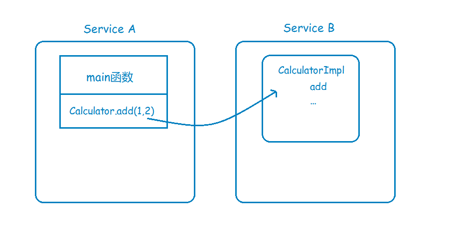
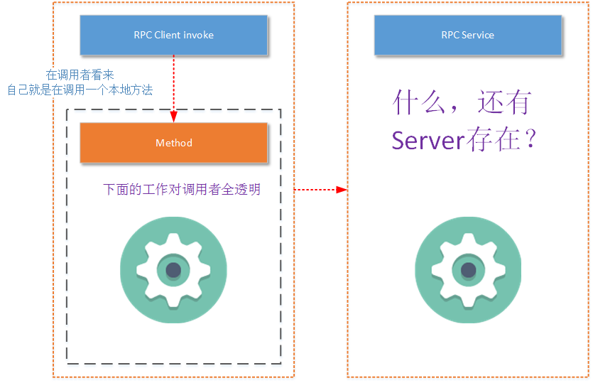
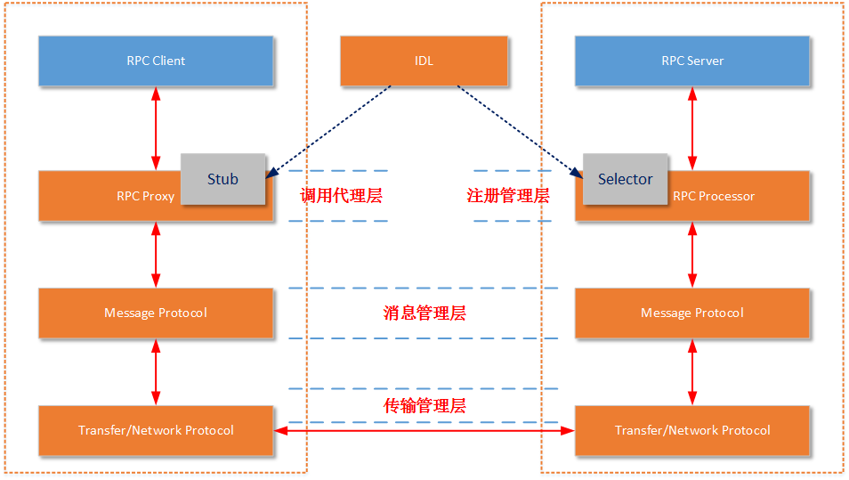

# RPC介绍

## RPC 产生的背景
+ 早期单机时代
    
  一台电脑上运行多个进程, 各个进程只干各自的事情，不出现信息交流。若某进程想要调用本机内另一个进程提供的复杂计算功能，即想要单机内不同的进程进行通讯，
  于是就出现了IPC **（Inter-process communication，单机中运行的进程之间的相互通信）**。现在A既然有了计算的功能，B就调用A进程上的计算功能好了。

+ 多主机时代
    不仅要在同一台主机不同进程之间进行调用，不同电脑之间还需要互相调用它方提供的服务，于是就程序员就把IPC扩展到网络上，这就有了RPC。
    这个时候计算的功能就可以作为一个独立的服务提供给其他客户机使用。

## 什么是RPC

Remote Procedure Call的简称,即 远程过程调用

理解
+ 客户端在不知道调用细节的情况下，调用存在于远程计算机上的某个对象，就像调用本地应用程序中的对象一样
+ 一种通过网络从远程计算机程序上请求服务，而不需要了解底层网络技术的协议

RPC是协议，只是一套规范，而不是一个具体实现

目前典型的RPC实现包括：Dubbo、Thrift、GRPC、Hetty等。

### RPC协议的特点
|特点|说明|
|-------|---------|
|网络协议和网络IO模型对其透明|既然RPC的客户端认为自己是在调用本地对象。那么传输层使用的是TCP/UDP还是HTTP协议，又或者是一些其他的网络协议它就不需要关心了。既然网络协议对其透明，那么调用过程中，使用的是哪一种网络IO模型调用者也不需要关心。|
|信息格式对其透明           |我们知道在本地应用程序中，对于某个对象的调用需要传递一些参数，并且会返回一个调用结果。至于被调用的对象内部是如何使用这些参数，并计算出处理结果的，调用方是不需要关心的。那么对于远程调用来说，这些参数会以某种信息格式传递给网络上的另外一台计算机，这个信息格式是怎样构成的，调用方是不需要关心的。| 
|应该有跨语言能力           |为什么这样说呢？因为调用方实际上也不清楚远程服务器的应用程序是使用什么语言运行的。那么对于调用方来说，无论服务器方使用的是什么语言，本次调用都应该成功，并且返回值也应该按照调用方程序语言所能理解的形式进行描述。|

一个基本的RPC结构

+ Client：RPC协议的调用方。就像上文所描述的那样，最理想的情况是RPC Client在完全不知道有RPC框架存在的情况下发起对远程服务的调用。但实际情况来说Client或多或少的都需要指定RPC框架的一些细节。
 
+ Server：在RPC规范中，这个Server并不是提供RPC服务器IP、端口监听的模块。而是远程服务方法的具体实现（在JAVA中就是RPC服务接口的具体实现）。其中的代码是最普通的和业务相关的代码，甚至其接口实现类本身都不知道将被某一个RPC远程客户端调用。
 
+ Stub/Proxy：RPC代理存在于客户端，因为要实现客户端对RPC框架“透明”调用，那么客户端不可能自行去管理消息格式、不可能自己去管理网络传输协议，也不可能自己去判断调用过程是否有异常。这一切工作在客户端都是交给RPC框架中的“代理”层来处理的。
 
+ Message Protocol：一次完整的client-server的交互肯定是携带某种两端都能识别的，共同约定的消息格式。RPC的消息管理层专门对网络传输所承载的消息信息进行编号和解码操作。目前流行的技术趋势是不同的RPC实现，为了加强自身框架的效率都有一套（或者几套）私有的消息格式。例如RMI框架使用的消息协议为JRMP；RPC框架Thrift也有私有的消息协议，“- Transfer/Network Protocol”（当然它还支持一些通用的消息格式，如JSON）。
 
+ Transfer/Network Protocol：传输协议层负责管理RPC框架所使用的网络协议、网络IO模型。例如Hessian的传输协议基于HTTP（应用层协议）；而Thrift的传输协议基于TCP（传输层协议）。传输层还需要统一RPC客户端和RPC服务端所使用的IO模型；常用的IO模型在之前已经详细讲解过了
 
+ Selector/Processor：存在于RPC服务端，由于服务器端某一个RPC接口的实现的特性（它并不知道自己是一个将要被RPC提供给第三方系统调用的服务）。所以在RPC框架中应该有一种“负责执行RPC接口实现”的角色。它负责了包括：管理RPC接口的注册、判断客户端的请求权限、控制接口实现类的执行在内的各种工作。
 
+ IDL：实际上IDL（接口定义语言）并不是RPC实现中所必须的。但是需要跨语言的RPC框架一定会有IDL部分的存在。这是因为要找到一个各种语言能够理解的消息结构、接口定义的描述形式。如果您的RPC实现没有考虑跨语言性，那么IDL部分就不需要包括，例如JAVA RMI因为就是为了在JAVA语言间进行使用，所以JAVA RMI就没有相应的IDL。
 
+ 一定要说明一点，不同的RPC框架实现都有一定设计差异。例如生成Stub的方式不一样，IDL描述语言不一样、服务注册的管理方式不一样、运行服务实现的方式不一样、采用的消息格式封装不一样、采用的网络协议不一样。但是基本的思路都是一样的，上图中的所列出的要素也都是具有的。

